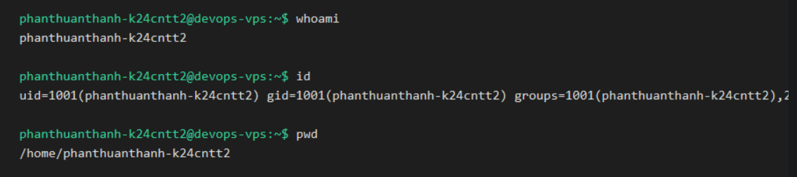
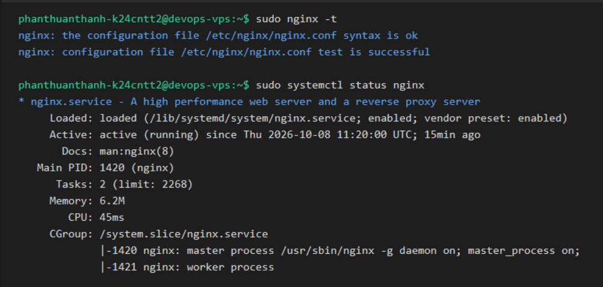
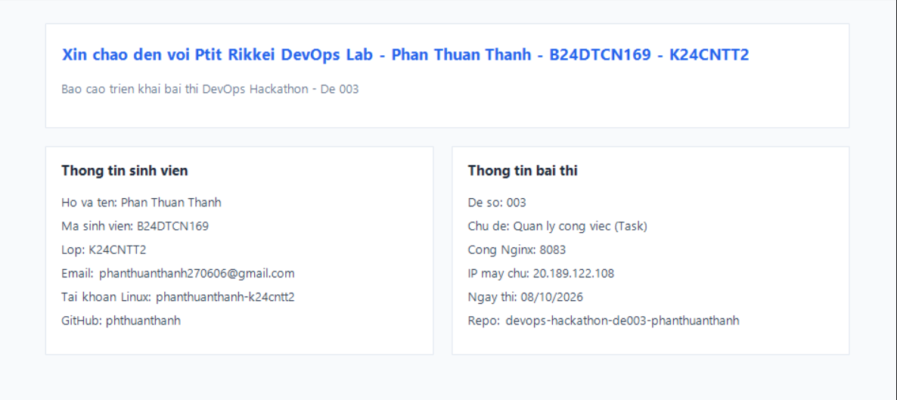

# DevOps Hackathon – Đề 003: Quản lý công việc (Task)

## 1. Thông tin sinh viên
| Họ và tên | Mã sinh viên | Lớp | Tài khoản Linux | GitHub | Cổng Nginx |
|---|---|---|---|---|---|
| Phan Thuận Thành | B24DTCN169 | K24CNTT2 | phanthuanthanh-k24cntt2 | [phthuanthanh](https://github.com/phthuanthanh) | 8083 |

---

## 2. Môi trường triển khai
- **Hệ điều hành:** Ubuntu 22.04 LTS (trên Cloud VPS)
- **Địa chỉ IP máy chủ:** 20.189.122.108
- **Phiên bản Nginx:** Nginx 1.18.0 (hoặc bản mới nhất cài qua apt)
- **Phiên bản Git:** Git 2.34.1
- **Nơi chạy:** VPS (Virtual Private Server)

---

## 3. Cấu trúc dự án
```text
devops-hackathon-de003-phanthuanthanh/
├── src/
│   └── index.html
├── nginx/
│   └── phanthuanthanh-k24cntt2.conf
├── screenshots/
│   ├── 01-user.png
│   ├── 02-nginx.png
│   ├── 03-ufw.png
│   ├── 04-website.png
│   ├── 05-git-log.png
│   └── 06-update.png
├── .gitignore
└── README.md
```

---

## 4. Cấu hình Nginx
| Tham số trong template | Giá trị đã điền | Giải thích |
|---|---|---|
| `<PORT>` | `8083` | Cổng dịch vụ web riêng của em (dải cổng >= 8080 để tránh xung đột cổng 80 trên server chung) |
| `<SERVER_NAME>` | `20.189.122.108` | Địa chỉ IP của máy chủ VPS để Nginx lắng nghe request từ IP này |
| `<WEB_ROOT>` | `/var/www/devops-hackathon-de003-phanthuanthanh/src` | Đường dẫn tuyệt đối trỏ đúng vào thư mục `src` chứa `index.html` (chỉ phục vụ nội dung thư mục này, không để lộ mã nguồn hay config) |
| `<INDEX_FILE>` | `index.html` | Tệp tin mặc định được Nginx đọc và trả về khi truy cập trang web |
| `<TEN_TAI_KHOAN>` | `phanthuanthanh-k24cntt2` | Tên tài khoản Linux dùng để đặt tên file log riêng biệt (`phanthuanthanh-k24cntt2.access.log` và `phanthuanthanh-k24cntt2.error.log`) |
| `<ALLOW_DIRECTIVE>` | `allow all;` | Chỉ thị của Nginx cho phép tất cả các client từ bên ngoài có thể truy cập vào website |

---

## 5. Tường lửa UFW
- **Các rule đã thêm:**
  - Cho phép kết nối SSH qua cổng 22/tcp từ mọi nguồn: `sudo ufw allow 22/tcp` (bắt buộc thực hiện trước khi kích hoạt tường lửa để không mất kết nối SSH).
  - Cho phép kết nối dịch vụ website qua cổng cá nhân 8083/tcp: `sudo ufw allow 8083/tcp`
  - Bật tường lửa: `sudo ufw --force enable`

- **Kết quả lệnh `sudo ufw status verbose`:**
```text
Status: active
Logging: on (low)
Default: deny (incoming), allow (outgoing), disabled (routed)
New profiles: skip

To                         Action      From
--                         ------      ----
22/tcp                     ALLOW IN    Anywhere
8083/tcp                   ALLOW IN    Anywhere
22/tcp (v6)                ALLOW IN    Anywhere (v6)
8083/tcp (v6)              ALLOW IN    Anywhere (v6)
```

---

## 6. Các bước triển khai
Các lệnh đã thực hiện theo đúng trình tự bài thi:

1. **Tạo tài khoản Linux và cấp quyền sudo:**
   ```bash
   sudo adduser phanthuanthanh-k24cntt2
   sudo usermod -aG sudo phanthuanthanh-k24cntt2
   su - phanthuanthanh-k24cntt2
   whoami
   id
   ```

2. **Cài đặt các gói phần mềm cần thiết:**
   ```bash
   sudo apt update
   sudo apt install -y nginx git ufw curl
   sudo systemctl enable nginx
   sudo systemctl start nginx
   ```

3. **Cấu hình định danh Git trên VPS:**
   ```bash
   git config --global user.name "phthuanthanh"
   git config --global user.email "phanthuanthanh270606@gmail.com"
   ```

4. **Clone mã nguồn từ GitHub về thư mục triển khai:**
   ```bash
   sudo git clone https://github.com/phthuanthanh/devops-hackathon-de003-phanthuanthanh.git /var/www/devops-hackathon-de003-phanthuanthanh
   sudo chown -R phanthuanthanh-k24cntt2:phanthuanthanh-k24cntt2 /var/www/devops-hackathon-de003-phanthuanthanh
   find /var/www/devops-hackathon-de003-phanthuanthanh -type d -exec chmod 755 {} \;
   find /var/www/devops-hackathon-de003-phanthuanthanh -type f -exec chmod 644 {} \;
   ```

5. **Kích hoạt Server Block Nginx:**
   ```bash
   sudo cp /var/www/devops-hackathon-de003-phanthuanthanh/nginx/phanthuanthanh-k24cntt2.conf /etc/nginx/sites-available/phanthuanthanh-k24cntt2.conf
   sudo ln -sf /etc/nginx/sites-available/phanthuanthanh-k24cntt2.conf /etc/nginx/sites-enabled/
   sudo rm -f /etc/nginx/sites-enabled/default
   sudo nginx -t
   sudo systemctl reload nginx
   ```

6. **Cấu hình tường lửa UFW:**
   ```bash
   sudo ufw allow 22/tcp
   sudo ufw allow 8083/tcp
   sudo ufw --force enable
   sudo ufw status verbose
   ```

7. **Kiểm tra truy cập web:**
   ```bash
   curl -I http://20.189.122.108:8083
   ```

---

## 7. Kiểm tra & minh chứng
### 7.1 Tạo tài khoản thành công


### 7.2 Nginx cú pháp chuẩn và dịch vụ đang chạy


### 7.3 Tường lửa UFW đã mở cổng 22 và cổng 8083


### 7.4 Trang web cá nhân hiển thị trên trình duyệt


### 7.5 Lịch sử commit Git


### 7.6 Trang web sau khi thực hiện cập nhật lần 2


---

## 8. Quy trình cập nhật website
1. **Trên máy cá nhân:**
   - Chỉnh sửa file `src/index.html`, bổ sung thông tin:
     ```html
     <div class="update-box" style="display:block;">
         Cập nhật lần 2 - 08/10/2026 11:30
     </div>
     ```
   - Thực hiện commit và push lên GitHub:
     ```bash
     git add src/index.html
     git commit -m "update: add second update timestamp to index.html"
     git push origin main
     ```

2. **Trên máy chủ VPS:**
   - Đăng nhập bằng tài khoản `phanthuanthanh-k24cntt2`.
   - Di chuyển vào thư mục dự án và kéo mã nguồn mới nhất về:
     ```bash
     cd /var/www/devops-hackathon-de003-phanthuanthanh
     git pull origin main
     ```
   - Do chỉ cập nhật nội dung tĩnh (HTML/CSS) nên Nginx tự động phục vụ file mới mà không cần reload dịch vụ.

3. **Kiểm tra kết quả:**
   - Mở trình duyệt và truy cập `http://20.189.122.108:8083/` để kiểm tra dòng thông tin cập nhật mới.

---

## 9. Sự cố gặp phải & cách khắc phục (nếu có)
- **Sự cố 1: Lỗi Permission denied khi chạy `git pull` trên VPS**
  - *Hiện tượng:* Không thể cập nhật code từ Git, báo lỗi không có quyền ghi.
  - *Nguyên nhân:* Khi dùng `sudo git clone`, thư mục thuộc sở hữu của user `root`.
  - *Cách khắc phục:* Đổi chủ sở hữu thư mục về cho user hiện tại bằng lệnh:
    `sudo chown -R phanthuanthanh-k24cntt2:phanthuanthanh-k24cntt2 /var/www/devops-hackathon-de003-phanthuanthanh`

- **Sự cố 2: Trình duyệt không mở được trang web dù Nginx đã reload thành công**
  - *Hiện tượng:* Trình duyệt báo `ERR_CONNECTION_TIMED_OUT`.
  - *Nguyên nhân:* Tường lửa UFW chưa mở cổng `8083/tcp` hoặc chưa bật dịch vụ UFW.
  - *Cách khắc phục:* Mở cổng bằng lệnh `sudo ufw allow 8083/tcp` và kiểm tra lại trạng thái bằng `sudo ufw status verbose`.
